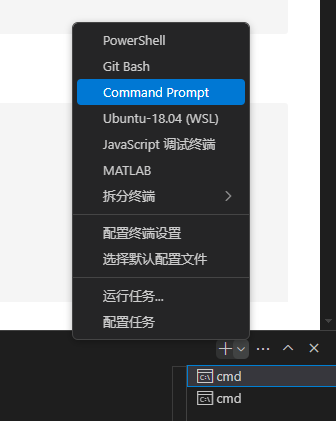

# Python代码在线执行系统

这是一个基于React前端和FastAPI后端的Python代码在线执行系统，允许用户在浏览器中编写Python代码并安全地在服务器上执行。

## 系统架构

系统由两个主要部分组成：

1. **前端**：使用React构建，集成Monaco Editor作为代码编辑器
2. **后端**：使用Python/FastAPI构建，提供代码执行API，在安全的环境中运行用户提交的Python代码

## 功能特点

- 美观的代码编辑器，支持语法高亮和自动缩进
- 实时代码执行，快速获取结果
- 安全的代码执行环境，限制资源使用和执行时间
- 清晰的错误信息展示
- 响应式设计，适配不同设备

## 安装步骤

### 前提条件

- Node.js (v14+)
- Python 3.10+
- pnpm包管理器
    - Windows 环境下推荐使用 npm 安装 `npm install -g pnpm`
    - 在 VSCode 中使用终端时也许需要选择 Command Prompt：
    

### 前端安装

```bash
# 进入前端目录
cd code-examiner-agent/frontend

# 安装依赖
pnpm install

# 启动开发服务器
pnpm run dev
```

#### 前端连接数据库
在`code-examiner-agent/frontend`目录创建`.env`文件，格式参照`.env.example`，填入KEY

### 后端安装

```bash
# 进入后端目录
cd code-examiner-agent/backend

# 创建并激活虚拟环境
python -m venv venv
source venv/bin/activate  # Linux/Mac
# 或 venv\Scripts\activate  # Windows

# 安装依赖
pip install fastapi uvicorn pydantic python-multipart redis pika python-dotenv langchain langgraph langchain-openai langchain-mcp-adapters supabase

# 运行redis和rabbitmq
docker-compose up -d

# 启动后端服务器
python -m uvicorn main:app --host 0.0.0.0 --port 8000
```

## 使用方法

1. 启动前端和后端服务器
2. 在浏览器中访问 `http://localhost:5173/`
3. 在代码编辑器中编写Python代码
4. 点击"执行代码"按钮运行代码
5. 查看执行结果或错误信息

## 安全措施

后端实现了多种安全措施来保护服务器：

- 代码在隔离的环境中执行
- CPU时间限制（5秒）
- 内存使用限制（128MB）
- 输出大小限制（1MB）
- 执行超时处理

## 项目结构

```
python-code-executor/
├── frontend/                # 前端React项目
│   ├── src/
│   │   ├── components/      # React组件
│   │   │   ├── CodeEditor.jsx  # 代码编辑器组件
│   │   │   └── CodeEditor.css  # 编辑器样式
│   │   ├── App.tsx          # 主应用组件
│   │   ├── App.css          # 应用样式
│   │   └── main.tsx         # 入口文件
│   └── package.json         # 前端依赖配置
└── backend/                 # 后端FastAPI项目
    ├── main.py              # 主应用文件，包含API定义
    └── test_api.sh          # API测试脚本
```

## 扩展可能性

- 添加用户账户系统，保存代码历史
- 支持更多编程语言
- 添加文件上传和下载功能
- 实现代码分享功能
- 集成更多Python库和框架

## 故障排除

- 如果前端无法连接到后端，请确保后端服务器正在运行，并检查CORS配置
- 如果代码执行超时，可能是因为代码中存在无限循环或耗时操作
- 如果遇到内存限制错误，尝试优化代码或减少数据处理量
